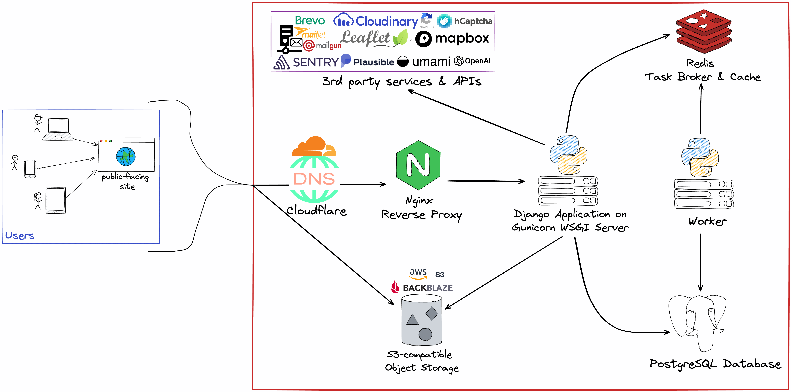

# Architecture

The architecture of _webinar_ consists of several key components that work together to deliver the application's functionality. Understanding the architecture will help you navigate the codebase and make informed decisions during development and maintenance.

{ data-description="webinar Architecture Diagram" }

!!! note

    The project runs on [Docker](https://www.docker.com/)

The organization and structure of the project's source code is discussed in the [Project Structure](./project-structure.md) section.

---
